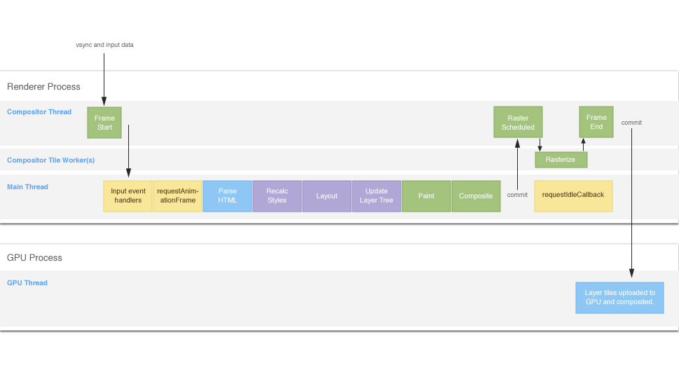
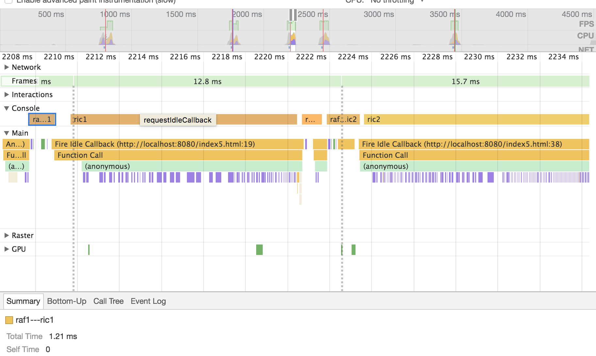
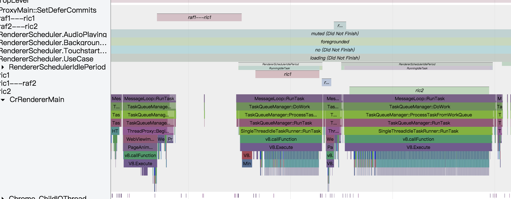

# requestIdleCallback
想探索下requestIdleCallback的秘密，结果发现探索失败。   

这是网上的图片，图上展示requestIdleCallback是在frame的最后阶段执行的，而相对的requestAnimationFrame是在frame的开头执行的，之前研究过requestAnimationFrame，发现requestAnimationFrame的执行位置是固定的。   

## demo
* [`demo1`](https://codepen.io/yoution/pen/bLZvgx)   
测试过程使用的是一个例子，在里面通过`console.time`进行打点进行测试的，打了`raf1---ric1`,`ric1`，`ric1---raf2`，`raf2---ric2`，`ric2`。在requestIdleCallback里设置样式强制layout，所以在图上可以看到直观的密集的竖状并排的类似二维码的图案。

* timeline图

在timeline上看到frame是由竖直的虚线分隔，发现requestIdleCallback确实在frame的最后位置执行了，但是在frame的最后位置，requestIdleCallback还没有执行完，导致执行到了下一个frame，这种现象和猜测相反，所以从timeline上无法查这个问题

* tracing图

在tracing上虽然看到内部的执行过程，但是tracing图无法看到各个frame的分隔

## 参考
[`The Anatomy of a Frame`](https://aerotwist.com/blog/the-anatomy-of-a-frame/)
